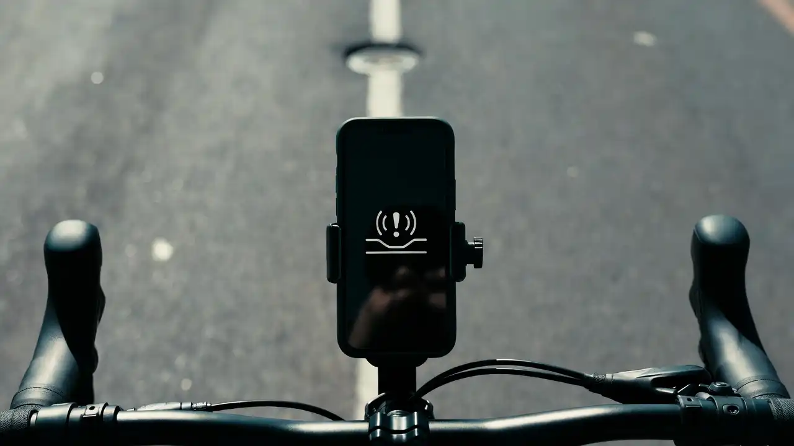

# Roadsense - 道路颠簸感知App

适用于 **iOS** 的骑行路况记录类应用：在**使用 App 期间**通过 **CoreLocation** 采集轨迹并在 **MapKit** 上展示；通过 **CoreMotion**（设备运动 / userAcceleration）对路面颠簸与冲击做**简化检测与分级**，生成可回顾的骑行会话（本机存储）。

## 功能概要

- 首次启动欢迎说明；首页地图在授权后聚焦当前位置附近。
- **记录**：开始/结束骑行；轨迹折线 + 按路段舒适度着色（平滑 / 颠簸 / 冲击）；冲击点标注。
- **历史**：查看已保存会话列表（数据默认仅存本机 JSON）。
- **灵敏度**：可调节颠簸检测阈值相关参数（面向「路上大颠簸」的实用设定）。
- **权限**：定位（When In Use）、运动与健身。

## 隐私与数据

- 骑行会话与轨迹数据**默认保存在用户设备**，不经由开发者自有服务器汇总。
- **未**使用 App 跟踪透明度（ATT）弹窗；不向用户索取 IDFA 用于跨 App 追踪。
- 定位与传感器用途以App Store Connect **App 隐私**申报为准。

## 重要提示

- 颠簸检测为**启发式算法**，受速度、支架固定、GPS 精度等影响，**仅供日常参考**，不可替代专业道路检测或安全判断。
- 骑行时请遵守交通法规，避免操作手机导致危险。

## 支持与反馈

技术说明、缺陷报告与功能建议可通过本仓库 **Issues** 提交（若仓库公开）；App Store **支持 URL** 建议指向可访问的同类说明页面。

---

© 2026 Roadsense · 道路颠簸感知App
